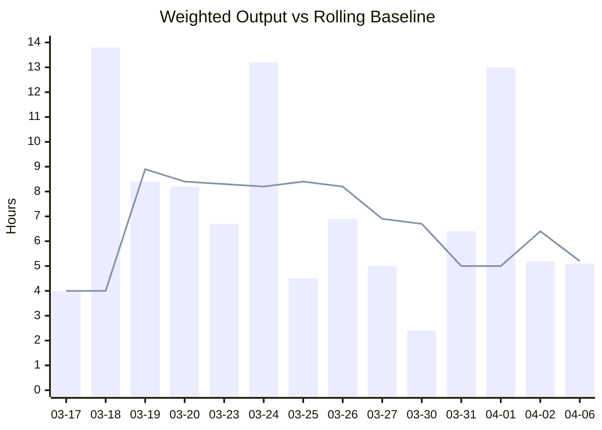
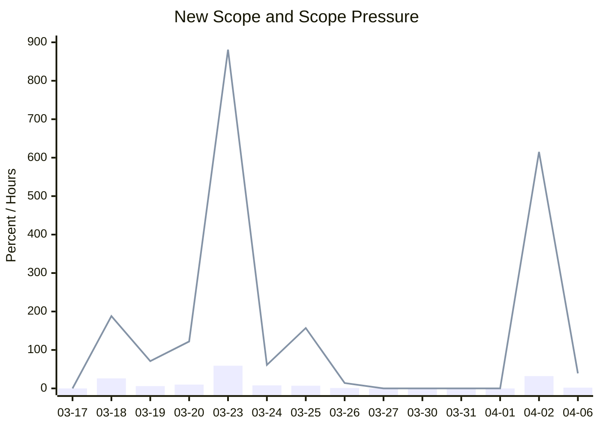
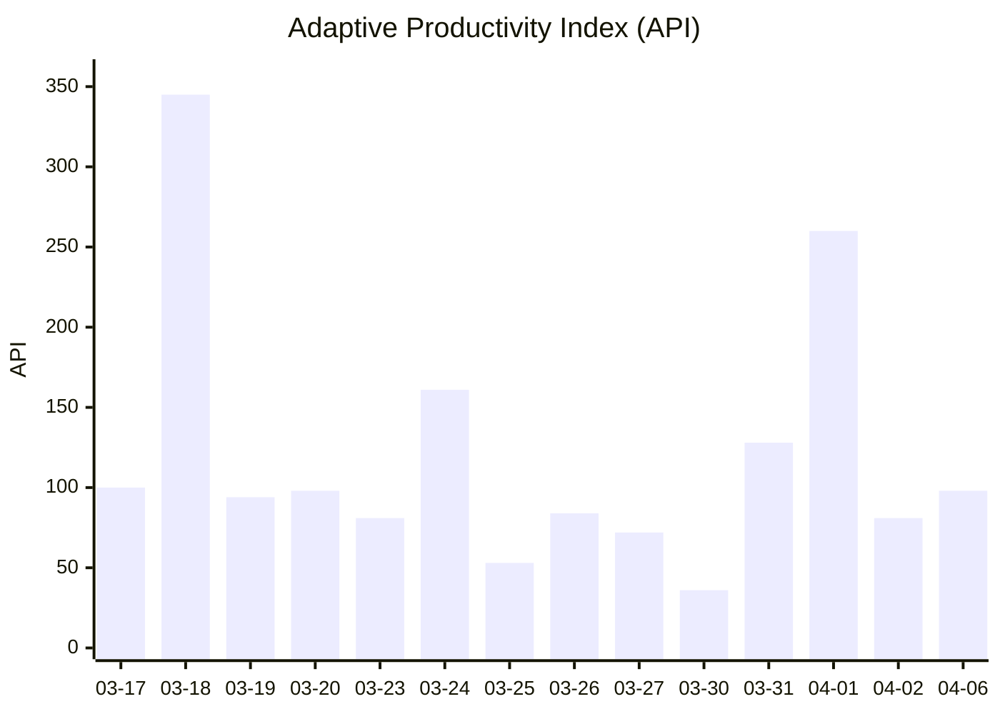
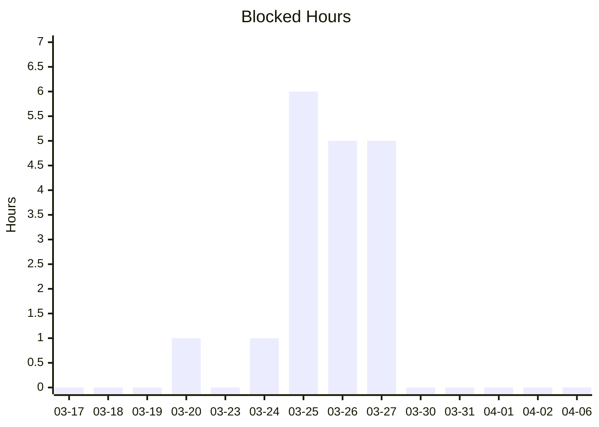

- Last updated: `2026-04-07`
- Source: [[statistics|Productivity Statistics]]

## Weighted Output Vs Baseline

## Work Mix

```mermaid
xychart-beta
    title "Shipped vs Response vs Progress"
    x-axis ["03-17","03-18","03-19","03-20","03-23","03-24","03-25","03-26","03-27","03-30","03-31","04-01","04-02","04-06"]
    y-axis "Hours" 0 --> 14
    bar [4.0,11.0,7.0,7.0,6.0,10.5,2.0,2.0,5.0,0.0,5.0,13.0,1.0,0.0]
    bar [0.0,4.0,2.0,1.0,1.0,1.0,3.5,7.0,0.0,2.0,2.0,0.0,6.0,3.0]
    bar [0.0,0.0,0.0,1.0,0.0,4.0,0.0,0.0,0.0,2.0,0.0,0.0,0.0,6.0]
```

## Scope Pressure

## Adaptive Productivity Index

## Blockers

## Read

- The strongest delivery spikes so far are `2026-03-18`, `2026-03-24`, and `2026-04-01`.
- The biggest scope-pressure spikes are `2026-03-23` and `2026-04-02`, both driven by major intake/bundle creation rather than weak execution alone.
- The lowest-output days are not pure failure days; they are mostly response-heavy or blocker-heavy days.
- The rolling baseline is now stable enough to make the API useful as a short-horizon management signal, but it is still not strong enough for long-range forecasting by itself.
